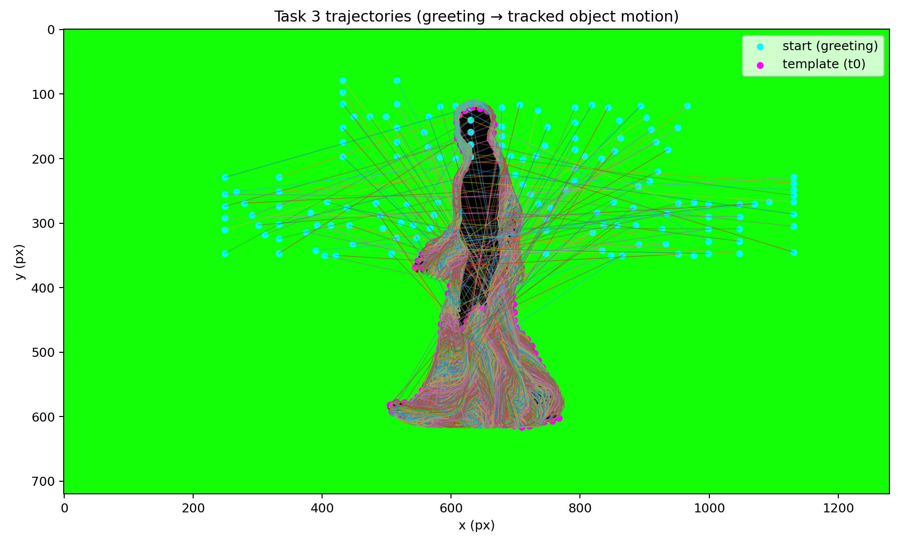

# Numerical Programming Final Project — Illuminated Drone Show Simulation

This repository contains the implementation of a synchronized drone swarm simulation with shape preservation for three tasks:
- **Task 1**: Static formation on a handwritten input
- **Task 2**: Transition to "Happy New Year!" greeting
- **Task 3**: Dynamic tracking and shape preservation on a video

---

##  Prerequisites

Make sure you have the following installed:
- Python 3.7+
- OpenCV (`pip install opencv-python`)
- NumPy (`pip install numpy`)
- SciPy (`pip install scipy`)
- Matplotlib (`pip install matplotlib`)
- Pillow (`pip install pillow`)

Or install everything at once:
```bash
pip install opencv-python numpy scipy matplotlib pillow
```

---

##  Quick Start

### Complete Pipeline (All Tasks)

Run all tasks sequentially from the project root:

```bash
# ============================================
# TASK 1: Static Formation
# ============================================

# Step 1: Extract target points
python3 extract_target_points.py \
  --image task1/inputs/name.png \
  --n 200 --mode skeleton --min-target-spacing 5 \
  --out-dir task1/outputs --debug-png --debug-point-radius 2

# Step 2: Generate trajectories
python3 task1/simulate_drones.py \
  --model swarm --k-rep 160 --r-safe 50 \
  --k-p 2.0 --k-d 2.5 --v-max 1e9 \
  --t-end 12 --steps 120 \
  --save-gif --save-traj-csv --save-traj-npy --save-traj-plot \
  --spline-smooth --spline-degree 3 \
  --drone-size 21 --target-size 35 --initial-size 21

# ============================================
# TASK 2: Transition to Greeting
# ============================================

# Step 1: Extract greeting target points
python3 extract_target_points.py \
  --image task2/inputs/greeting.png \
  --n 200 --mode skeleton --min-target-spacing 10 \
  --out-dir task2/outputs --debug-png

# Step 2: Generate transition trajectories
python3 task2/transition.py \
  --start task1/outputs/target_points.csv \
  --targets task2/outputs/target_points.csv \
  --bg-target task2/inputs/greeting.png \
  --model swarm --k-rep 220 --r-safe 14 \
  --k-p 3.0 --k-d 3.5 --v-max 400 \
  --t-end 20 --steps 200 \
  --collision-report --collision-threshold 50 \
  --save-gif --save-traj-csv --save-traj-npy --save-traj-plot \
  --spline-smooth --spline-degree 3 \
  --full-view --output-prefix full_transition

# ============================================
# TASK 3: Dynamic Tracking
# ============================================

# Generate dynamic tracking with optical flow
python3 task3/dynamic_tracking.py \
  --tracking-mode hybrid \
  --use-optical-flow \
  --controller direct \
  --video-step 1 \
  --contour-upscale 3.0 --contour-smooth 9 \
  --segmenter greenscreen \
  --spline-smooth --spline-degree 3 \
  --save-gif --save-traj-csv --save-traj-npy --gif-fps 30 \
  --output-gif task3/outputs/task3_optical_flow_hybrid.gif \
  --drone-size 13
```

---

## Detailed Instructions

### Task 1: Static Formation on Handwritten Input

#### Overview
- Loads `task1/inputs/name.png`
- Converts to grayscale and binarizes with `THRESH_BINARY_INV` (text becomes white, background black)
- Finds external contours with `cv2.findContours`
- Samples **N equally spaced points** along the contour(s)
- Generates drone trajectories using swarm IVP with collision avoidance

#### Step 1: Extract Target Points

```bash
python3 extract_target_points.py \
  --image task1/inputs/name.png \
  --n 200 \
  --mode skeleton \
  --min-target-spacing 5 \
  --out-dir task1/outputs \
  --debug-png \
  --debug-point-radius 2
```

**What it does:**
- Extracts 200 target points from the handwritten name image
- Uses skeleton mode for better point placement
- Saves `task1/outputs/target_points.csv` and `target_points.npy`
- Creates `debug_target_points.png` for visualization

#### Step 2: Generate Drone Trajectories

```bash
python3 task1/simulate_drones.py \
  --model swarm \
  --k-rep 160 \
  --r-safe 50 \
  --k-p 2.0 \
  --k-d 2.5 \
  --v-max 1e9 \
  --t-end 12 \
  --steps 120 \
  --save-gif \
  --save-traj-csv \
  --save-traj-npy \
  --save-traj-plot \
  --spline-smooth \
  --spline-degree 3 \
  --drone-size 21 \
  --target-size 35 \
  --initial-size 21
```

**What it does:**
- Reads target points from `task1/outputs/target_points.csv`
- Generates trajectories using swarm IVP with repulsion (collision avoidance)
- Applies spline smoothing to trajectories
- Saves:
  - `task1/outputs/drone_trajectories.csv`
  - `task1/outputs/drone_trajectories.npy`
  - `task1/outputs/drone_trajectories.png`
  - `task1/outputs/drone_motion.gif`

**Outputs:**
- `task1/outputs/target_points.csv`
- `task1/outputs/drone_trajectories.csv`
- `task1/outputs/drone_trajectories.png`
- `task1/outputs/drone_motion.gif`

#### Preview

Input (handwritten name):


Extracted target points (debug):


Trajectories:


Animation:


---

### Task 2: Transition to "Happy New Year!"

#### Overview
- **Start**: Task 1 final formation (`task1/outputs/target_points.csv`)
- **Goal**: Greeting target points extracted from `task2/inputs/greeting.png`
- **Trajectory generator**: `task2/transition.py` (BVP solved via shooting or swarm IVP)
- **Validation**: Optional closest-approach collision diagnostic (`--collision-report`)

#### Step 1: Extract Greeting Target Points

```bash
python3 extract_target_points.py \
  --image task2/inputs/greeting.png \
  --n 200 \
  --mode skeleton \
  --min-target-spacing 10 \
  --out-dir task2/outputs \
  --debug-png
```

** Important:** Use the **same `--n 200`** as in Task 1

#### Step 2: Generate Transition Trajectories

```bash
python3 task2/transition.py \
  --start task1/outputs/target_points.csv \
  --targets task2/outputs/target_points.csv \
  --bg-target task2/inputs/greeting.png \
  --model swarm \
  --k-rep 220 \
  --r-safe 14 \
  --k-p 3.0 \
  --k-d 3.5 \
  --v-max 400 \
  --t-end 20 \
  --steps 200 \
  --collision-report \
  --collision-threshold 50 \
  --save-gif \
  --save-traj-csv \
  --save-traj-npy \
  --save-traj-plot \
  --spline-smooth \
  --spline-degree 3 \
  --full-view \
  --output-prefix full_transition
```

**Notes:**
- Start→target assignment uses Hungarian matching by default (disable with `--no-assign`)
- Collision reporting helps diagnose potential collisions

**Outputs:**
- `task2/outputs/full_transition_trajectories.csv`
- `task2/outputs/full_transition_trajectories.png`
- `task2/outputs/full_transition_motion.gif`

#### Preview

Greeting image:


Extracted greeting target points (debug):


Transition trajectories:


Transition animation:


---

### Task 3: Dynamic Tracking and Shape Preservation

#### Overview
- **Start**: Task 2 greeting formation (`task2/outputs/target_points.csv`)
- **Input**: A video (`task3/video.mp4`)
- **Task**: Move the swarm onto a moving object in the video, then repeat its motion with **shape preservation**
- **Output**: Trajectories + visualization (GIF)

**Features:**
- **Optical Flow**: Farneback's dense optical flow for improved tracking
- **Spline Smoothing**: Optional trajectory smoothing using cubic splines
- **Multiple tracking modes**: contour, optical_flow, hybrid

#### Basic Tracking (Contour Only)

```bash
python3 task3/dynamic_tracking.py \
  --tracking-mode contour \
  --controller direct \
  --video-step 1 \
  --contour-upscale 3.0 \
  --contour-smooth 9 \
  --segmenter greenscreen \
  --save-gif \
  --save-traj-csv \
  --save-traj-npy \
  --gif-fps 30 \
  --output-gif task3/outputs/task3_contour_direct_hi_with_video.gif \
  --drone-size 13
```

#### Advanced Tracking (with Optical Flow) - **Recommended!**

```bash
python3 task3/dynamic_tracking.py \
  --tracking-mode hybrid \
  --use-optical-flow \
  --controller direct \
  --video-step 1 \
  --contour-upscale 3.0 \
  --contour-smooth 9 \
  --segmenter greenscreen \
  --spline-smooth \
  --spline-degree 3 \
  --save-gif \
  --save-traj-csv \
  --save-traj-npy \
  --gif-fps 30 \
  --output-gif task3/outputs/task3_optical_flow_hybrid.gif \
  --drone-size 13
```

**New features:**
- `--use-optical-flow`: Enable optical flow for target prediction (Farneback method)
- `--tracking-mode {contour,optical_flow,hybrid}`: Choose tracking strategy
- `--spline-smooth`: Apply spline smoothing to trajectories
- `--spline-degree {1,2,3}`: Spline degree (1=linear, 2=quadratic, 3=cubic)

**Outputs:**
- `task3/outputs/task3_trajectories.csv`
- `task3/outputs/task3_trajectories.npy`
- `task3/outputs/task3_optical_flow_hybrid.gif`

#### Preview

Trajectories:



High-detail tracking (with video):


---


##  Troubleshooting

### Problem 1: "ModuleNotFoundError: No module named 'cv2'"
**Solution:**
```bash
pip install opencv-python
```

### Problem 2: "FileNotFoundError: task1/outputs/target_points.csv"
**Solution:**
Make sure you run `extract_target_points.py` for Task 1 first!

### Problem 3: "N mismatch: start has X points, targets has Y points"
**Solution:**
Make sure you use the same `--n` value in both Task 1 and Task 2 (e.g., `--n 200`)

### Problem 4: "Could not open video: task3/video.mp4"
**Solution:**
Make sure `task3/video.mp4` exists!

---

##  Quick Test (Minimal Run)

If you want to quickly verify that everything works:

```bash
# Task 1 (minimal)
python3 extract_target_points.py --image task1/inputs/name.png --n 50 --out-dir task1/outputs
python3 task1/simulate_drones.py --save-traj-csv --save-traj-plot

# Task 2 (minimal)
python3 extract_target_points.py --image task2/inputs/greeting.png --n 50 --out-dir task2/outputs
python3 task2/transition.py --start task1/outputs/target_points.csv --targets task2/outputs/target_points.csv --save-traj-csv

# Task 3 (minimal)
python3 task3/dynamic_tracking.py --save-traj-csv --save-gif
```

---

##  Additional Options

### Show Visualization (without saving to files)
Add the `--show` flag:
```bash
python3 task1/simulate_drones.py --show ...
```

### Other Segmenters for Task 3
```bash
# MOG2 background subtraction
--segmenter mog2

# Edge detection
--segmenter edges --canny1 60 --canny2 150
```

### BVP Shooting Mode (Task 1 and Task 2)
```bash
--model shooting --k-p 2.0 --k-d 0.5
```

---

##  Verification

If everything ran correctly, you should see:
-  CSV and NPY files in output directories
-  PNG trajectory plots
-  GIF animations
-  "Saved: ..." messages in the console

---


##  Features

### Mathematical Models
- **IVP (Initial Value Problem)**: Swarm dynamics with repulsion
- **BVP (Boundary Value Problem)**: Shooting method for transitions
- **Velocity Saturation**: Physical constraints on drone velocity
- **Collision Avoidance**: Repulsive forces between drones

### Numerical Methods
- **RK45**: Adaptive Runge-Kutta method (4th/5th order)
- **RK4**: Manual implementation for dynamics controller
- **Shooting Method**: BVP solver for trajectory planning
- **Spline Interpolation**: Trajectory smoothing

### Image Processing
- **Edge Detection**: Canny edge detection
- **Contour Extraction**: External contour finding
- **Skeletonization**: Zhang-Suen thinning algorithm
- **Optical Flow**: Farneback's dense optical flow
