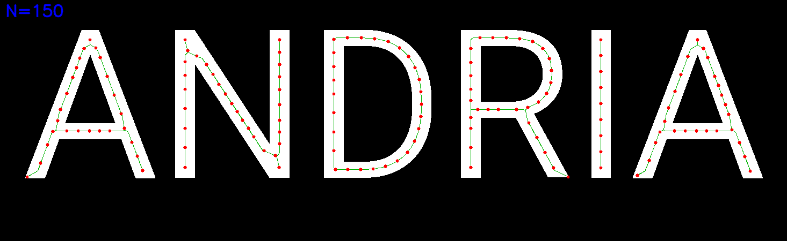
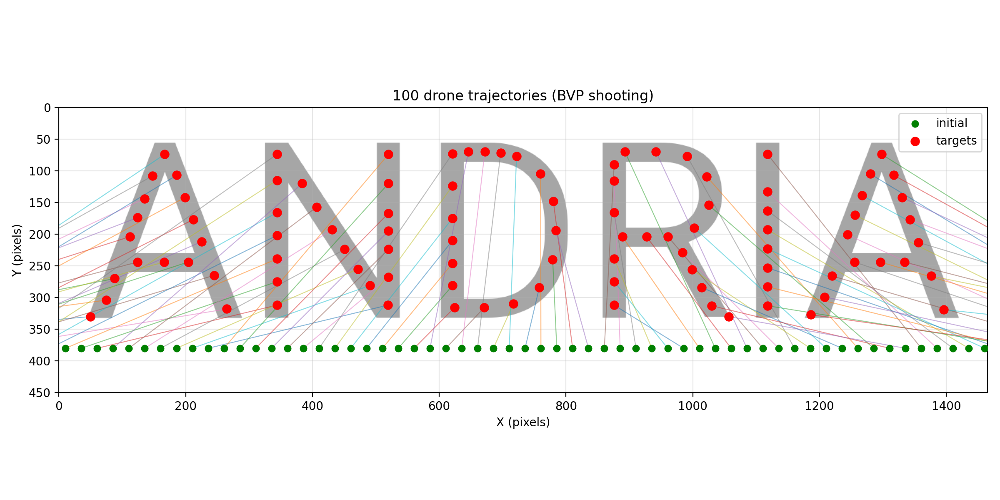
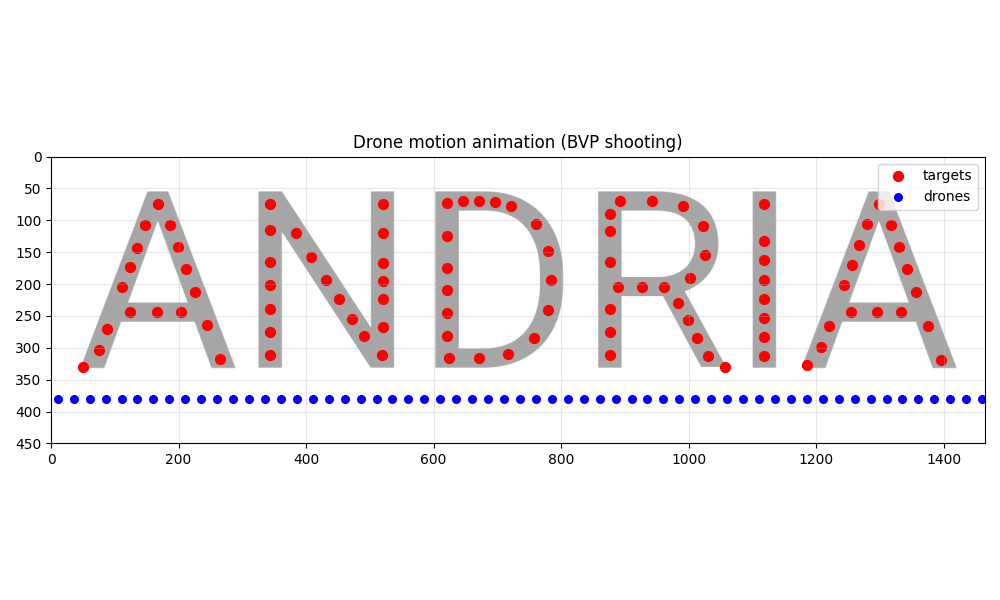
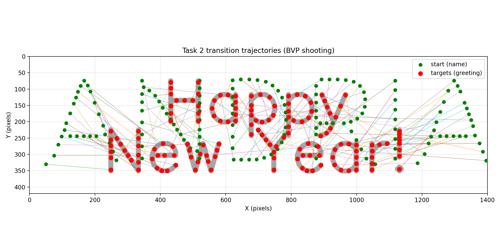
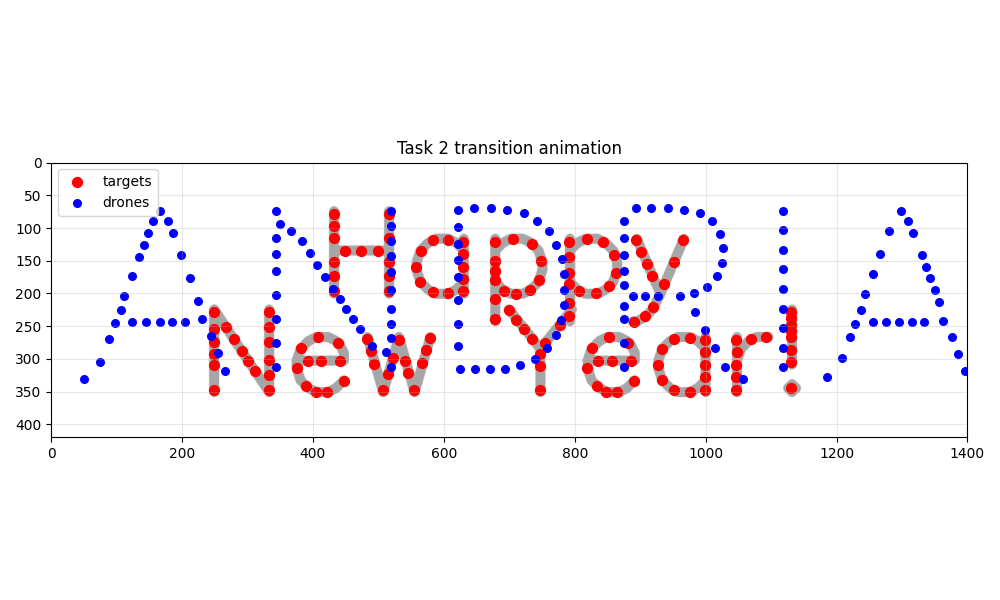

# Numerical Programming Final Project — Target Points Extraction

This repo is organized by tasks:
- `task1/` — Task 1 (static formation on a handwritten input)
- `task2/` — Task 2 (transition to greeting: "Happy New Year!")
- `task3/` — placeholder (not started)

## Task 1 (high level)

- Loads `task1/inputs/name.png`
- Converts to grayscale
- Binarizes with `THRESH_BINARY_INV` so **text becomes white (255)** and background black (0)
- Finds external contours with `cv2.findContours` (**no Canny needed**)
- Samples **N equally spaced points** along the contour(s)
- Saves into `task1/outputs/`:
  - `target_points.npy` (NumPy array, shape `(N, 2)`)
  - `target_points.csv` (same points as CSV, header `x,y`)
  - `debug_target_points.png` (optional) for visual checking

## Run

From the project root:

```bash
python3 task1/extract_target_points.py --n 100 --mode interior --debug-png
```

Optional:

```bash
python3 task1/extract_target_points.py --n 100 --mode interior --show
```

Point size tweaks:

```bash
python3 task1/extract_target_points.py --n 100 --mode interior --min-border-dist 6 --debug-png --debug-point-radius 4
python3 task1/extract_target_points.py --n 100 --mode interior --show --show-point-size 90
```

Better readability per letter (recommended):

```bash
python3 task1/extract_target_points.py --n 100 --mode interior --min-per-component 8 --debug-png
python3 task1/extract_target_points.py --n 100 --mode interior --extreme-dirs 8 --debug-png
```

Medial axis (skeleton) mode (points lie on the centerline):

```bash
python3 task1/extract_target_points.py --n 100 --mode skeleton --min-per-component 8 --debug-png
```

## Drone simulation (BVP shooting + animation)

Generate trajectories using **BVP (shooting)** (accurate target hitting) and animate:

```bash
python3 task1/simulate_drones.py \
  --bvp-match-final-velocity --bvp-final-velocity-weight 3.0 \
  --k-p 2.0 --k-d 2.5 \
  --t-end 20 --steps 200 --show
```

Save a GIF + trajectories:

```bash
python3 task1/simulate_drones.py \
  --bvp-match-final-velocity --bvp-final-velocity-weight 3.0 \
  --k-p 2.0 --k-d 2.5 \
  --t-end 20 --steps 200 --save-gif --save-traj-csv --save-traj-npy
```

## Option 5: Trajectory optimization (direct transcription + collision penalty)

This is a simple **trajectory optimization** approach (not just ODE integration):
- Variables are positions \(p_i(t_k)\) on a coarse time grid.
- Objective includes smoothness + reaching targets + collision-avoidance penalty.

Show windows:

```bash
python3 task1/optimal_trajectories.py --initial hline_below --offset 50 --k-steps 80 --iters 80 --lr 1e-4 --r-safe 10 --show
```

Save GIF + npy:

```bash
python3 task1/optimal_trajectories.py --k-steps 80 --iters 80 --lr 1e-4 --r-safe 10 --save-gif --save-npy
```

## Outputs (Task 1)

- `task1/outputs/target_points.npy`
- `task1/outputs/target_points.csv`
- `task1/outputs/debug_target_points.png` (only if you pass `--debug-png`)

## Task 1: preview (generated)

Input (handwritten name):


Extracted target points (debug):



Trajectories:



Animation:



## Task 2 (high level) — Transition to "Happy New Year!"

- **Start**: Task 1 final formation (`task1/outputs/target_points.csv`)
- **Goal**: greeting target points extracted from `task2/inputs/greeting.png`
- **Trajectory generator**: `task2/transition.py` (BVP solved via shooting)
- **Validation**: optional closest-approach collision diagnostic (`--collision-report`)

### Task 2: run

Generate the greeting image:

```bash
python3 task2/generate_greeting_image.py --out task2/inputs/greeting.png
```

Extract greeting target points (use the same `--n` as Task 1):

```bash
python3 task1/extract_target_points.py \
  --image task2/inputs/greeting.png \
  --n 100 --mode skeleton --min-target-spacing 5 \
  --out-dir task2/outputs --debug-png
```

Generate transition trajectories + GIF:

```bash
python3 task2/transition.py \
  --start task1/outputs/target_points.csv \
  --targets task2/outputs/target_points.csv \
  --bg-target task2/inputs/greeting.png \
  --bvp-match-final-velocity --bvp-final-velocity-weight 3.0 \
  --k-p 2.0 --k-d 2.5 \
  --t-end 20 --steps 200 \
  --collision-report --collision-threshold 12 \
  --save-gif --save-traj-csv --save-traj-npy --save-traj-plot
```

### Task 2: preview (generated)

Greeting image:


Extracted greeting target points (debug):


Transition trajectories:



Transition animation:


